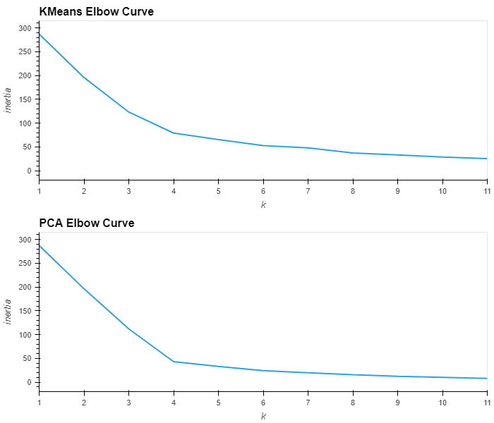
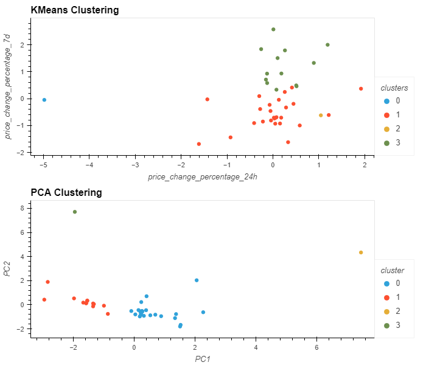

# CryptoClustering

Module 19 Challenge - Unsupervised Machine Learning

Robertson, J 

---
## Analysis
Through the use of Python, this project explores unsupervised machine learning tools to predict if cryptocurrencies are affected by 24-hour or 7-day price changes. The following dependencies were used to analyse the data:

    import pandas as pd
    import hvplot.pandas
    from sklearn.cluster import KMeans
    from sklearn.decomposition import PCA
    from sklearn.preprocessing import StandardScaler

Data was imported and transformed (standardised & scaled) using the StandardScaler() function. The scaled data was analysed using the KMeans, PCA and the elbow curve method to identify the most significant change in inertia to determine the ideal KMeans value.

From the visual analysis of each elbow curve, a KMeans value of 4 for each analytical method fits the data best.

The ideal KMeans for each analysis method used to fit and transform, and predict cluster groups based on the scaled data. The generated groups were plotted as scatter plots to visualise the difference in grouping from each analytical method.

Each of the analytical methods has produced vastly different data clustering. Using the PCA method and reducing the features to be compared we've generated two distinct, closely clustered groups. From the surface the PCA method appears to suit this dataset better.

## References
- *Composing Plots — HoloViz 0.16.3 documentation*, (2023-12-04) Holoviz contributors, https://holoviz.org/tutorial/Composing_Plots.html